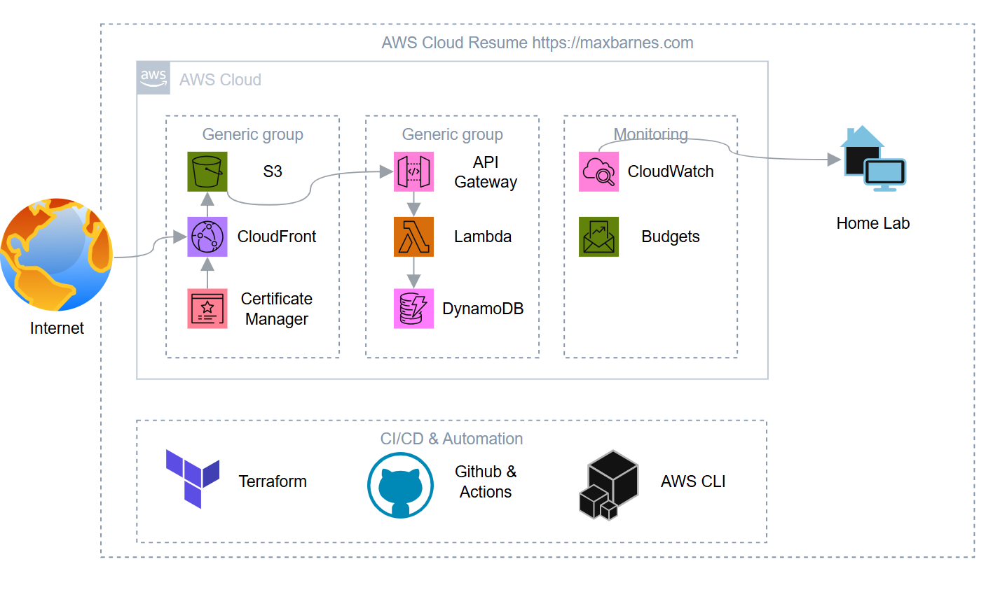

# Cloud Resume Challenge

My take on the [Cloud Resume Challenge](https://cloudresumechallenge.dev/) — a hands-on project that combines cloud infrastructure, serverless development, and DevOps practices to build and deploy a resume website on AWS.

### **Live site:** [maxbarnes.com](https://maxbarnes.com)

---

## Overview

This project takes a simple resume webpage and turns it into a fully cloud-hosted, serverless application with a live visitor counter. It touches nearly every layer of the AWS stack — from static hosting and CDN distribution to serverless compute, a NoSQL database, and automated CI/CD deployment.

## Architecture Diagram

## Tech Stack

| Layer | Service/Tool |
|---|---|
| Frontend | HTML, CSS, JavaScript |
| Static hosting | Amazon S3 |
| CDN / HTTPS | Amazon CloudFront |
| DNS | GoDaddy (domain registrar) |
| Backend API | Amazon API Gateway |
| Compute | AWS Lambda (Python) |
| Database | Amazon DynamoDB |
| Infrastructure as Code | Terraform |
| CI/CD | GitHub Actions |
| Testing | Cypress |
| Source control | Git / GitHub |

## What I Built

### 1. Frontend — Resume Website
- Wrote a static resume site using HTML, CSS, and JavaScript.
- Hosted the site in an S3 bucket configured for static website hosting.
- Put CloudFront in front of the bucket to serve content over HTTPS globally with low latency and to enable caching.
- Requested/attached an SSL/TLS certificate via AWS Certificate Manager (ACM) so the site loads securely.
- Pointed my GoDaddy-registered domains (maxbarnes.com & max-barnes.com) at the CloudFront distribution (via CNAME/ALIAS-style record) so the site is reachable from a custom domain instead of the default `*.cloudfront.net` URL.

### 2. Visitor Counter — Backend
- Added a small JavaScript snippet on the resume page that calls a backend API on page load to fetch and increment the visitor count, then displays it on the page.
- Built the API using API Gateway, which routes incoming requests to a Lambda function.
- The Lambda function (Python) reads the current count from DynamoDB, increments it, writes it back, and returns the updated value as JSON.
- DynamoDB stores a single item (or one item per page) tracking the visit count — chosen for its serverless, pay-per-request pricing and simplicity for this use case.
- Configured CORS on API Gateway so the frontend (served from my domain) can call the API from the browser without being blocked.

### 3. Infrastructure as Code
- Defined all AWS resources (S3 bucket, CloudFront distribution, API Gateway, Lambda, DynamoDB table, IAM roles/policies) as code using Terraform imports.
- This makes the entire stack reproducible — I can tear it down and redeploy it from scratch with a single command instead of manually clicking through the AWS Console.
- Set the Terraform backend to S3 to allow multiple devices to manage the state.

### 4. Testing
- Wrote unit tests for the Lambda function and frontend using Cypress, mocking the DynamoDB calls to verify the counter logic works as well as frontend elements.
- Tests run automatically as part of the CI pipeline before any deployment.

### 5. CI/CD Pipeline
- Set up GitHub Actions workflows to automate deployment:
  - on Push to main, all tests are run. 
- Left the GitHub Action workflow to deploy changes to S3 and invalidate CloudFront cache as a manual trigger to prevent pushing un-needed changes. In production you would want separate frontend and backend triggers, but for this project I believe ths is a practical way to do it.

## Thanks to [Forrest Brazeal](https://forrestbrazeal.com/) for creating the [Cloud Resume Challenge](https://cloudresumechallenge.dev/).